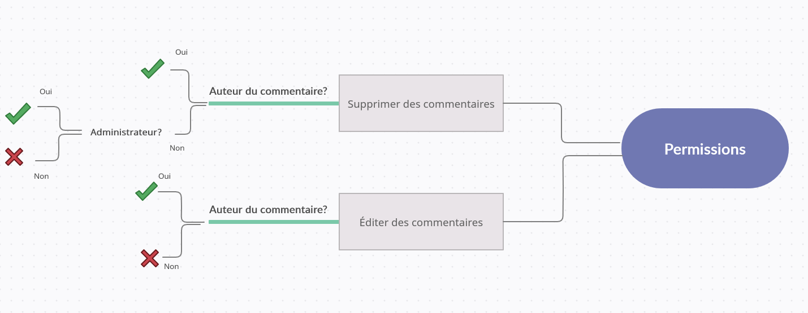
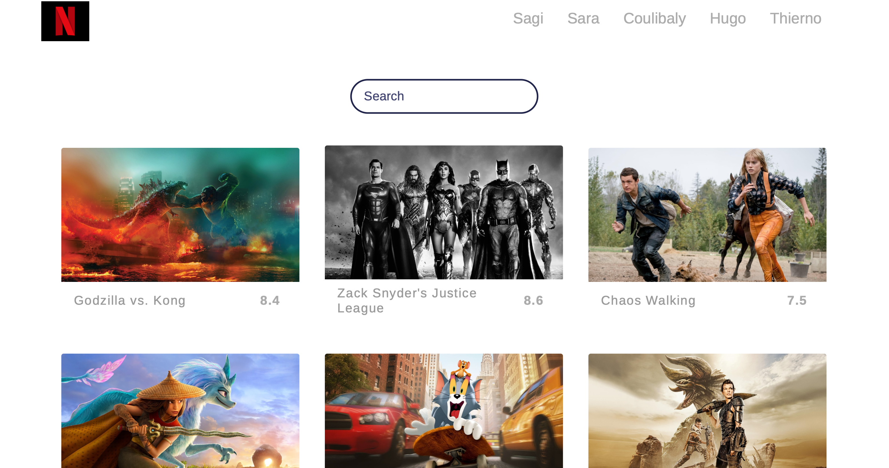

# GetFlix

# GetFlix
## What is GetFlix?
#### GetFlix is a streaming site inspired by platforms such as NetFlix and Youtube, with a catalog of movies which the users can filter in the search bar. The site includes also a space to comment on the content. Administrators have access to a backoffice to manage the comments.
 
## Why GetFlix?
#### This project was build in the context of BeCode Web Development course. The main goal was to consolidate our skills of PHP and MySQL, as well as the ability to communicate and work in a team. 

## Get to Work 
#### We had 10 days to complete the task. Our first step was to think about the deployment of our future site. Since GitHub does not support PHP, we decided to try WebHost, which is a free alternative. We took a moment to get familiar with it, by registering and creating a first database. After reflecting on our database, we started to split tasks. We had daily meetings to monitor the development of the project, identify difficulties, or redefine tasks.

## Challenges
#### One of the major difficulties were the permissions. We wanted the users to be allowed to edit or delete their comments, but not other users' comments. This was the idea:

#### For the administrators, we build a backoffice, but the problem with the different permissions on the site still remains. For the moment, everybody can edit or delete any comment.  

## Our Home Page

## Build with
 * HTML5
 * CSS3
 * Bootstrap
 * Javascript
 * PHP

## Members of the group
* Hugo Contor
* Sagi
* Thierno Barry
* Housseynou Coulibaly
* Sara Brazuna Tavares Gomes

## Link to our site
[GetFlix](https://getflix-get.000webhostapp.com/index.php)

